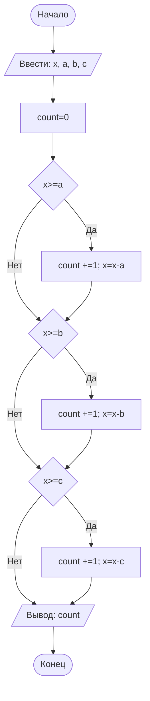

# Отчет по лабораторной работе №1

#### № группы: `ПМ-2601`

#### Выполнила: `Гусар Александра Андреевна`

#### Вариант: `7`

### Cодержание:

- [Постановка задачи](#1-постановка-задачи)
- [Входные и выходные данные](#2-входные-и-выходные-данные)
- [Выбор структуры данных](#3-выбор-структуры-данных)
- [Алгоритм](#4-алгоритм)
- [Программа](#5-программа)
- [Анализ правильности решения](#6-анализ-правильности-решения)

### 1. Постановка задачи
> Три покупателя стоят в очереди за бананами. Они планируют купить A, B,
> C килограмм бананов соответственно порядку в очереди. Если к моменту,
> когда приходит его очередь, в магазине не остаётся нужного покупателю
> количества бананов, покупатель уходит, ничего не купив. Изначально в магазине имеется X кг бананов. Сколько покупателей смогут купить бананы,
> которые они планируют? На вход программы подаются натуральные числа
> X, A, B, C.

Основная задача: определить количество покупателей, которые смогли купить бананы.

Условие: Очередь не прерывается, если покупатель ушел. Возможно следующему покупателю хватит бананов, чтобы их купить.
(например: Если всего 5кг бананов, первому нужно купить 6кг, второму 2кг, третьему 3кг. Тогда после первого покупателя очередь не прерывается, так как второму и третьему хватит бананов для покупки.)

### 2. Входные и выходные данные.

#### Данные на вход.

На вход программа должна получать 4 целых положительных (натуральных) числа.
- X - общее количество кг бананов.
- A - количество бананов, которое собирается купить первый покупатель.
- B - количество бананов, которое собирается купить второй покупатель.
- C - количество бананов, которое собирается купить третий покупатель.

|             | Тип                | min значение    | max значение   |
|-------------|--------------------|-----------------|----------------|
| X (Число 1) | Целое положительное (натуральное число)  | 1               | -              |
| A (Число 2) | Целое положительное (натуральное число)  | 1               | -              |
| B (Число 2) | Целое положительное (натуральное число)  | 1               | -              |
| C (Число 2) | Целое положительное (натуральное число)  | 1               | -              |

#### Данные на выход.

На выходе мы должны получить единственное целое неотрицательное число(назовем его count), т.к. это должно быть 
количество покупателей, которые смогли совершить покупку.

|             | Тип                | min значение    | max значение   |
|-------------|--------------------|-----------------|----------------|
| count(Число 1) | Целое неотрицательное  | 0              | 3              |

### 3. Выбор структуры данных

Программа получает 4 целых положительных (натуральных) числа, поэтому для их хранения можно выделить 4 переменных (`x`,`a`,`b`,`c`) типа `int`. 
Для вывода ответа нам нужна отдельная переменная `count` типа `int`, которая является целым неотрицательным числом от 0 до 3.

|             | название переменной | Тип (в Java) | 
|-------------|---------------------|--------------|
| X  | `x`                 | `int`     |
| A  | `a`                 | `int`     |
| B  | `b`                 | `int`     |
| C  | `c`                 | `int`     |
| count  | `count`                 | `int`     |

### 4. Алгоритм

#### Алгоритм выполнения программы:

1. **Ввод данных:**  
   Программа считывает 4 целых положительных (натуральных) числа, обозначенные как `x`, `a`, `b`, `c`.

2. **Новая переменная**:
   Создаем переменную count равную 0.

4. **Первый покупатель:**  
   Программа сравнивает значения `x` и `a`. Если `x` больше или равно `a`, программа увеличивает переменную `count` на 1 и уменьшает значение `x` на `a`(новое `x` становится равно `x-a`. Если `x` меньше `a` переходим к следующему покупателю (переменной `b`), `x` остается прежним.

5. **Второй покупатель:**  
   Программа сравнивает значения `x` и `b`. Если `x` больше или равно `b`, программа увеличивает переменную `count` на 1 и уменьшает значение `x` на `b`(новое `x` становится равно `x-b`. Если `x` меньше `b` переходим к следующему покупателю (переменной `c`), `x` остается прежним.

6. **Третий покупатель:**  
   Программа сравнивает значения `x` и `c`. Если `x` больше или равно `c`, программа увеличивает переменную `count` на 1 и уменьшает значение `x` на `c`(новое `x` становится равно `x-c`. Если `x` меньше `a` переходим к выводу ответа.

7. **Вывод результата:**  
   На экран выводится значение переменной `count`.

#### Блок-схема

